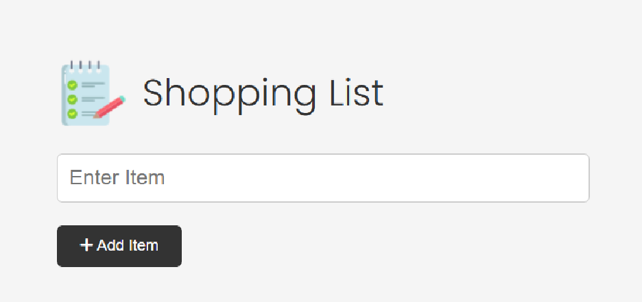
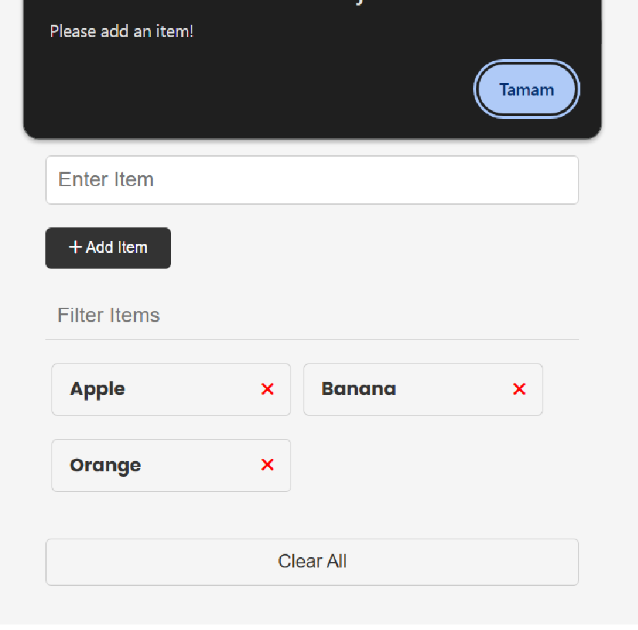
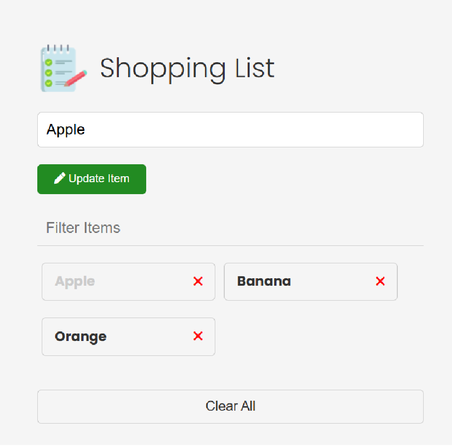
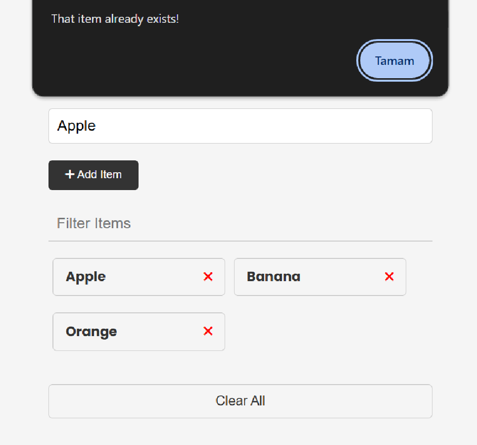

# :clipboard: Shopping List

#### This app allows you to create a fun shopping list using your local store.

### :grey_question: What you can do in this app:

#### - Add data.

#### - Update data (by clicking on the data you want to update).

#### - Delete data one by one (by pressing the X button.)

#### - Delete data collectively.

### :heavy_exclamation_mark: There are some controls you need to know before using the application:

#### - You cannot add empty data!

#### - You cannot add the same data again.

### :camera: Screenshots of the project:

